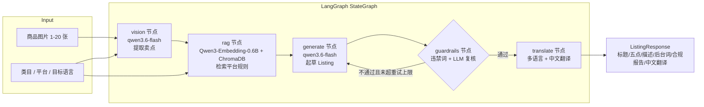

# CrossLister

> 开源、可自部署的**多模态跨境电商 Listing 生成 Agent**。
> 上传商品图 → 视觉卖点提取 → 平台规则 RAG 检索 → 合规审核 → 多语言 Listing 一键生成。

跨境卖家最头疼的事：同一款商品要在 Amazon、Shopee、Temu 上各写一份 Listing，
还要分别满足三个平台完全不同的标题规范、违禁词与内容规则。CrossLister 用一条
**LangGraph 流水线**把这件事自动化，并且**完全跑在你自己的机器上**——图片与
文案不出内网，模型可自托管。

---

## ✨ 核心特性

- **多模态理解**：用 qwen3.6-flash 从 1–20 张商品图中提取类目、颜色、材质、卖点与使用场景。
- **多产品并发处理**：支持同时录入多个产品，批量生成 Listing，所有产品并发处理。
- **批量导入**：通过 CSV/Excel 模板文件一次性导入多个产品信息，自动校验并提示错误。
- **生成历史记录（冷存储）**：每次生成完成后异步落盘（文字 + 压缩图片，可配置），
  纯文件系统存储、与主流程完全解耦，前端可随时回看历史结果；超限自动清理最旧记录。
- **平台规则 RAG**：内置 Amazon / Shopee / Temu 规则文档，用 Qwen3-Embedding-0.6B 向量化后按平台
  分 collection 存入 ChromaDB，按商品语义检索最相关的规则条目喂给生成模型。
- **自研合规护栏**：三层防线——平台硬性结构规则纯代码校验（标题长度/bullet
  数量/关键词字节/URL/价格字样，零成本零幻觉）、分平台违禁词扫描、LLM 语义复核；
  不合格则带着违规点**回到生成节点重写，最多循环 3 次**。
- **多语言输出 + 中文翻译**：通过合规后的 Listing 生成目标语言内容，并附带严格对照的中文翻译。
- **三档运行模式**：`mock`（离线可跑，零依赖零网络）/ `local`（自托管 vLLM）/ `api`
  （任意 OpenAI 兼容端点），开发、测试、生产无缝切换。
- **极简依赖**：核心只依赖 FastAPI + LangGraph + ChromaDB + openai SDK，不绑死任何云厂商。

---

## 🏗️ 架构



关键实现点：

| 组件 | 技术 | 说明 |
| --- | --- | --- |
| 编排 | LangGraph `StateGraph` | 节点间通过 `AgentState` 传递，合规失败条件回边 |
| 视觉 | OpenAI Vision 协议 | vLLM / 云端 API 共用一条代码路径 |
| 检索 | ChromaDB（嵌入式持久化） | 每平台一个 collection，按规则条目分 chunk |
| Embedding | Qwen3-Embedding-0.6B（OpenAI 兼容 `/embeddings`） | 或离线 mock embedder |
| 服务 | FastAPI + Pydantic v2 | multipart 上传，结构化校验，并发处理 |
| 日志 | structlog | JSON 结构化输出 |

---

## 🚀 Quick Start

### 1. 准备环境

需要 Python 3.11+ 与 [uv](https://docs.astral.sh/uv/)：

```bash
git clone <your-repo-url> CrossLister
cd CrossLister
uv sync
```

### 2. 配置 `.env`

```bash
cp .env.example .env
```

**默认就是 `mock` 模式，无需任何模型和网络即可跑通全流程**。要接入真实模型，
只需在 `.env` 里把对应 `*_MODE` 改成 `local` 或 `api` 并填好端点（见下文
[模型与 API 配置](#模型与-api-配置)）。

### 3. 构建平台规则索引

```bash
uv run python scripts/build_index.py
```

会读取 `data/platform_rules/*.md`，切分为规则 chunk 并写入 `data/chroma/`
（内置 Amazon / Shopee / Temu 各 10 条规则，共 30 个 chunk）。

### 4. 启动服务

```bash
uv run uvicorn app.main:app --host 0.0.0.0 --port 8080
```

### 5. 使用 Web 界面

打开浏览器访问 `http://localhost:8080`，即可看到中文操作界面。

#### 手动录入

- 点击「+ 添加产品」可添加多个产品标签页
- 每个产品独立配置：商品图片、类目、目标平台、目标语言、补充信息
- 补充信息支持 **JSON 格式** 或 **自然语言** 两种输入方式
- 点击「批量生成 Listing」并发处理所有产品

#### 批量导入

1. 点击「批量导入」按钮
2. 点击「下载导入模板」获取 CSV 模板
3. 按模板格式填写产品信息（每行一个产品）
4. 上传 CSV 或 Excel 文件
5. 系统自动解析并校验，预览表格中标记错误行
6. 为每个产品上传商品图片
7. 点击「确认导入」将产品添加到录入列表

模板字段说明：

| 字段 | 必填 | 说明 |
|------|------|------|
| 商品类目 | 是 | 产品所属分类，如 `Home & Kitchen > Storage` |
| 目标平台 | 是 | 可选值：`amazon` / `shopee` / `temu` |
| 目标语言 | 是 | 可选值：`en` `zh` `ja` `ko` `es` `fr` `de` `pt` `th` `vi` `id` `ms` |
| 补充信息 | 否 | JSON 格式或自然语言描述 |

### 6. 调用 API

**单个产品生成：**

```bash
curl -X POST http://localhost:8080/api/v1/listing/generate \
  -F "images=@./product.png;type=image/png" \
  -F "category=storage organizer" \
  -F "platform=amazon" \
  -F "target_lang=en"
```

**多产品并发生成（multipart 二进制上传）：**

`products` 字段为产品元数据的 JSON 数组，每个产品用 `image_count` 声明
自己的图片数量；所有图片按产品顺序以 `images` 文件域依次上传（产品 0 的
图片在前，接着产品 1……），服务端按声明数量顺序切片归属。

```bash
curl -X POST http://localhost:8080/api/v1/listing/batch_generate \
  -F 'products=[
    {"product_index":0,"category":"storage organizer","platform":"amazon","target_lang":"en","image_count":1},
    {"product_index":1,"category":"electronics","platform":"shopee","target_lang":"zh","image_count":1}
  ]' \
  -F "images=@./product0.png;type=image/png" \
  -F "images=@./product1.png;type=image/png"
```

> 图片以二进制直传（无 base64 膨胀）。上传前服务端会自动将图片缩放到
> `VISION_MAX_IMAGE_SIDE`（默认 1280px）并压缩为 JPEG，避免超出远端网关
> 的请求体限制。

**批量导入模板下载：**

```bash
curl -O http://localhost:8080/api/v1/import/template
```

**批量导入文件解析：**

```bash
curl -X POST http://localhost:8080/api/v1/import/parse \
  -F "file=@./products.csv"
```

返回解析结果，包含每行产品的校验状态和错误详情。

交互式 API 文档：打开 `http://localhost:8080/docs`。

---

## 🧠 模型与 API 配置

所有模型调用都走 **OpenAI 兼容 HTTP 端点**，在 `.env` 中为每种能力独立选择模式：

| 能力 | 默认模型 | 模式开关 | 端点配置 |
| --- | --- | --- | --- |
| 视觉理解 | `qwen3.6-flash` | `VISION_MODE` | `VISION_API_BASE` / `VISION_API_KEY` |
| 文本生成 / 合规 / 翻译 | `qwen3.6-flash` | `LLM_MODE` | `LLM_API_BASE` / `LLM_API_KEY` |
| 向量嵌入 | `Qwen/Qwen3-Embedding-0.6B` | `EMBEDDING_MODE` | `EMBEDDING_API_BASE` / `EMBEDDING_API_KEY` |

每种模式的取值：

- `mock`：确定性离线 stub，**不调用任何模型、不发任何网络请求**（开发与测试用）。
- `local`：你自己用 vLLM 起的 OpenAI 兼容服务（`docker-compose.yml` 里带模板）。
- `api`：任意托管的 OpenAI 兼容端点，填好 `*_API_BASE` 和 `*_API_KEY` 即可。

> 默认使用托管端点的 `qwen3.6-flash`；如需自托管（需 GPU），可用
> `vllm serve Qwen/Qwen2.5-VL-7B-Instruct --limit-mm-per-prompt image=20`，
> 然后把 `VISION_API_BASE=http://localhost:8000/v1`、`VISION_MODE=local`。

其他有用的配置项（见 `.env.example`）：

| 配置 | 默认 | 说明 |
| --- | --- | --- |
| `LLM_MAX_OUTPUT_TOKENS` | `2048` | 每次 LLM 调用的生成 token 上限，防失控生成 |
| `RAG_MIN_SCORE` | `0.0` | 检索相似度下限，低于该值的规则不进入 prompt |
| `RAG_AUTOBUILD_ON_STARTUP` | `false` | 启动时发现规则索引缺失/为空则后台自动重建 |
| `AUTH_API_KEY` | 空 | 设置后所有 `/api/*`（除 health）要求 `X-API-Key` 请求头 |

---

## 🔐 安全说明

服务默认面向本机/可信内网、零配置可用。若部署在共享网络，建议在 `.env`
中设置 `AUTH_API_KEY`：此后除健康检查外的全部 API 调用都必须携带
`X-API-Key: <你的密钥>` 请求头。Web 界面会在遇到 401 时自动弹出输入框，
密钥保存在浏览器 localStorage 并自动附带。

---

## 🔌 API 一览

| 方法 | 路径 | 说明 |
| --- | --- | --- |
| GET | `/api/v1/health` | 健康检查，返回各模块当前模式 |
| GET | `/api/v1/platforms` | 返回支持的平台列表 |
| GET | `/api/v1/languages` | 返回支持的 12 种目标语言 |
| POST | `/api/v1/listing/generate` | 单个产品：multipart 上传图片 + 表单字段，生成合规 Listing |
| POST | `/api/v1/listing/batch_generate` | 多产品并发：multipart（products JSON 字段 + 按产品顺序的 images 文件域） |
| POST | `/api/v1/listing/batch_generate_stream` | 同 batch_generate，但以 SSE 流式推送 `product_start` / `node` / `product_done` / `done` 事件，前端展示真实进度 |
| GET | `/api/v1/import/template` | 下载批量导入 CSV 模板 |
| POST | `/api/v1/import/parse` | 解析 CSV/Excel 文件，返回校验结果 |
| POST | `/api/v1/rag/rebuild` | 重建平台规则向量索引 |
| GET | `/api/v1/history` | 生成历史列表（索引摘要，最新在前；支持 `platform` / `status` 过滤） |
| GET | `/api/v1/history/{record_id}` | 单条历史详情（完整 Listing + 图片文件名） |
| DELETE | `/api/v1/history/{record_id}` | 删除一条历史记录（目录 + 索引条目） |
| GET | `/api/v1/history/{record_id}/images/{name}` | 读取历史中存储的压缩图片 |
| GET | `/api/v1/diag` | 诊断：当前配置 + 模块加载时间（确认服务已加载新代码） |

### 响应字段说明

`/listing/generate` 和 `/listing/batch_generate` 返回的 Listing 包含：

| 字段 | 说明 |
|------|------|
| `title` | 目标语言标题 |
| `title_zh` | 中文翻译标题 |
| `bullet_points` | 目标语言五点描述 |
| `bullet_points_zh` | 中文翻译五点描述 |
| `description` | 目标语言商品描述 |
| `description_zh` | 中文翻译商品描述 |
| `backend_keywords` | 后台关键词 |
| `compliance` | 合规审核报告 |
| `visual_analysis` | 视觉分析结果 |
| `metadata` | 生成元数据（模型、耗时、RAG 检索数） |

---

## 🆚 与 SaaS 方案的差异

市面上已有 Sorftime、SellerSprite、卖家精灵等跨境选品/文案 SaaS。CrossLister 走的是另一条路：

| 维度 | CrossLister（本项目） | Sorftime 等 SaaS |
| --- | --- | --- |
| 部署方式 | 开源自部署，代码全透明 | 闭源云服务 |
| 数据隐私 | 图片/文案不出内网，可完全离线 | 数据上传至第三方 |
| 模型选择 | 自托管 Qwen 或任意兼容端点，可换 | 由厂商决定，不可控 |
| 成本 | 一次部署，边际成本≈电费/自有算力 | 按席位/订阅持续付费 |
| 平台规则 | 规则文档在本地，可自改可扩展 | 黑盒，无法审计 |
| 二次开发 | 任意改流水线、加平台、加节点 | 不可定制 |
| 批量处理 | 支持多产品并发生成 + CSV/Excel 批量导入 | 通常逐个处理 |
| 开箱即用 | 需要一定部署能力 | 注册即用 |

一句话：**要省事选 SaaS；要数据主权、可控成本与可定制性，选 CrossLister。**

---

## 🧪 测试

全部测试在 `mock` 模式下离线运行：

```bash
uv run pytest -q
```

覆盖视觉解析、RAG loader/indexer/retriever（含分数阈值）、LangGraph 全链路
（含合规回环与结构性校验）、FastAPI 端到端 multipart 请求、SSE 流式生成
（事件序列与逐产品错误隔离）、历史记录冷存储（落盘/裁剪/删除/索引重建/过滤/
路径穿越防护）、可选 API Key 鉴权，以及共享 OpenAI 客户端缓存。

---

## 📁 目录结构

```
CrossLister/
├── app/
│   ├── agents/            # LangGraph 图与各节点（vision/rag/generate/guardrails/translate）
│   ├── api/               # FastAPI 路由 + 批量导入模块
│   │   ├── routes.py      # API 端点定义
│   │   ├── history.py     # 历史记录只读查看 API
│   │   └── batch_import.py # CSV/Excel 解析与校验
│   ├── guardrails/        # 违禁词过滤 + LLM 合规复核
│   ├── history/           # 生成历史冷存储（纯文件，与主管线解耦）
│   ├── llm/               # 共享文本 LLM 客户端
│   ├── models/            # Pydantic 数据模型
│   ├── rag/               # loader / indexer / retriever
│   ├── utils/             # structlog 日志 + 图片压缩工具
│   └── vision/            # 视觉客户端与 prompt
├── data/
│   ├── platform_rules/    # Amazon / Shopee / Temu 规则文档
│   ├── chroma/            # 向量库持久化目录（git 忽略）
│   └── history/           # 生成历史冷存储（git 忽略，运行时自动创建）
├── scripts/build_index.py # 索引构建 CLI
├── static/index.html      # 前端单页面（中文界面）
├── tests/                 # 离线测试 + 测试数据
├── .env.example           # 配置模板（复制为 .env）
└── docker-compose.yml     # API + 预留 vLLM GPU 服务
```

---

## 📄 License

本项目基于 [Apache License 2.0](./LICENSE) 开源。欢迎提 Issue 与 PR。
