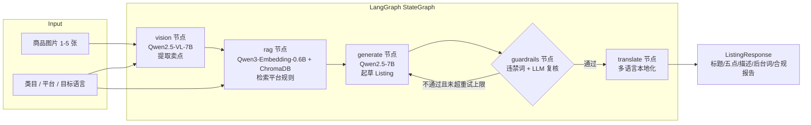

# CrossLister

> 开源、可自部署的**多模态跨境电商 Listing 生成 Agent**。
> 上传商品图 → 视觉卖点提取 → 平台规则 RAG 检索 → 合规审核 → 多语言 Listing 一键生成。

跨境卖家最头疼的事：同一款商品要在 Amazon、Shopee、Temu 上各写一份 Listing，
还要分别满足三个平台完全不同的标题规范、违禁词与内容规则。CrossLister 用一条
**LangGraph 流水线**把这件事自动化，并且**完全跑在你自己的机器上**——图片与
文案不出内网，模型可自托管。

---

## ✨ 核心特性

- **多模态理解**：用 Qwen2.5-VL-7B 从 1–5 张商品图中提取类目、颜色、材质、卖点与使用场景。
- **平台规则 RAG**：内置 Amazon / Shopee / Temu 规则文档，用 Qwen3-Embedding-0.6B 向量化后按平台
  分 collection 存入 ChromaDB，按商品语义检索最相关的规则条目喂给生成模型。
- **自研合规护栏**：先做确定性的分平台违禁词扫描，再由 LLM 做语义复核；
  不合格则带着违规点**回到生成节点重写，最多循环 3 次**。
- **多语言输出**：通过合规后的 Listing 可翻译成目标语言，保持营销语气与结构。
- **三档运行模式**：`mock`（离线可跑，零依赖零网络）/ `local`（自托管 vLLM）/ `api`
  （任意 OpenAI 兼容端点），开发、测试、生产无缝切换。
- **极简依赖**：核心只依赖 FastAPI + LangGraph + ChromaDB + openai SDK，不绑死任何云厂商。

---

## 🏗️ 架构



关键实现点：

| 组件 | 技术 | 说明 |
| --- | --- | --- |
| 编排 | LangGraph `StateGraph` | 节点间通过 `AgentState` 传递，合规失败条件回边 |
| 视觉 | OpenAI Vision 协议 | vLLM / 云端 API 共用一条代码路径 |
| 检索 | ChromaDB（嵌入式持久化） | 每平台一个 collection，按规则条目分 chunk |
| Embedding | Qwen3-Embedding-0.6B（OpenAI 兼容 `/embeddings`） | 或离线 mock embedder |
| 服务 | FastAPI + Pydantic v2 | multipart 上传，结构化校验 |
| 日志 | structlog | JSON 结构化输出 |

---

## 🚀 Quick Start

### 1. 准备环境

需要 Python 3.11+ 与 [uv](https://docs.astral.sh/uv/)：

```bash
git clone <your-repo-url> CrossLister
cd CrossLister
uv sync
```

### 2. 配置 `.env`

```bash
cp .env.example .env
```

**默认就是 `mock` 模式，无需任何模型和网络即可跑通全流程**。要接入真实模型，
只需在 `.env` 里把对应 `*_MODE` 改成 `local` 或 `api` 并填好端点（见下文
[模型与 API 配置](#模型与-api-配置)）。

### 3. 构建平台规则索引

```bash
uv run python scripts/build_index.py
```

会读取 `data/platform_rules/*.md`，切分为规则 chunk 并写入 `data/chroma/`
（内置 Amazon / Shopee / Temu 各 10 条规则，共 30 个 chunk）。

### 4. 启动服务

```bash
uv run uvicorn app.main:app --host 0.0.0.0 --port 8080
```

### 5. 调用 API

```bash
curl -X POST http://localhost:8080/api/v1/listing/generate \
  -F "images=@./product.png;type=image/png" \
  -F "category=storage organizer" \
  -F "platform=amazon" \
  -F "target_lang=en"
```

返回结构化的标题、五点描述、长描述、后台关键词、合规报告与视觉分析结果。

交互式 API 文档：打开 `http://localhost:8080/docs`。

---

## 🧠 模型与 API 配置

所有模型调用都走 **OpenAI 兼容 HTTP 端点**，在 `.env` 中为每种能力独立选择模式：

| 能力 | 默认模型 | 模式开关 | 端点配置 |
| --- | --- | --- | --- |
| 视觉理解 | `Qwen/Qwen2.5-VL-7B-Instruct` | `VISION_MODE` | `VISION_API_BASE` / `VISION_API_KEY` |
| 文本生成 / 合规 / 翻译 | `Qwen/Qwen2.5-7B-Instruct` | `LLM_MODE` | `LLM_API_BASE` / `LLM_API_KEY` |
| 向量嵌入 | `Qwen/Qwen3-Embedding-0.6B` | `EMBEDDING_MODE` | `EMBEDDING_API_BASE` / `EMBEDDING_API_KEY` |

每种模式的取值：

- `mock`：确定性离线 stub，**不调用任何模型、不发任何网络请求**（开发与测试用）。
- `local`：你自己用 vLLM 起的 OpenAI 兼容服务（`docker-compose.yml` 里带模板）。
- `api`：任意托管的 OpenAI 兼容端点，填好 `*_API_BASE` 和 `*_API_KEY` 即可。

> 自托管 vLLM 示例（需 GPU）：
> `vllm serve Qwen/Qwen2.5-VL-7B-Instruct --limit-mm-per-prompt image=5`，
> 然后把 `VISION_API_BASE=http://localhost:8000/v1`、`VISION_MODE=local`。

---

## 🔌 API 一览

| 方法 | 路径 | 说明 |
| --- | --- | --- |
| GET | `/api/v1/health` | 健康检查，返回各模块当前模式 |
| POST | `/api/v1/listing/generate` | multipart 上传图片 + 表单字段，生成合规 Listing |
| POST | `/api/v1/rag/rebuild` | 重建平台规则向量索引 |

`/listing/generate` 表单字段：`images`（1–5 张）、`category`、`platform`
（`amazon`/`shopee`/`temu`）、`target_lang`、`extra_info`（可选 JSON）。

---

## 🆚 与 SaaS 方案的差异

市面上已有 Sorftime、SellerSprite、卖家精灵等跨境选品/文案 SaaS。CrossLister 走的是另一条路：

| 维度 | CrossLister（本项目） | Sorftime 等 SaaS |
| --- | --- | --- |
| 部署方式 | 开源自部署，代码全透明 | 闭源云服务 |
| 数据隐私 | 图片/文案不出内网，可完全离线 | 数据上传至第三方 |
| 模型选择 | 自托管 Qwen 或任意兼容端点，可换 | 由厂商决定，不可控 |
| 成本 | 一次部署，边际成本≈电费/自有算力 | 按席位/订阅持续付费 |
| 平台规则 | 规则文档在本地，可自改可扩展 | 黑盒，无法审计 |
| 二次开发 | 任意改流水线、加平台、加节点 | 不可定制 |
| 开箱即用 | 需要一定部署能力 | 注册即用 |

一句话：**要省事选 SaaS；要数据主权、可控成本与可定制性，选 CrossLister。**

---

## 🧪 测试

全部测试在 `mock` 模式下离线运行：

```bash
uv run pytest -q
```

覆盖视觉解析、RAG loader/indexer/retriever、LangGraph 全链路（含合规回环）、
以及 FastAPI 端到端 multipart 请求。

---

## 📁 目录结构

```
CrossLister/
├── app/
│   ├── agents/            # LangGraph 图与各节点（vision/rag/generate/guardrails/translate）
│   ├── api/               # FastAPI 路由
│   ├── guardrails/        # 违禁词过滤 + LLM 合规复核
│   ├── llm/               # 共享文本 LLM 客户端
│   ├── models/            # Pydantic 数据模型
│   ├── rag/               # loader / indexer / retriever
│   ├── utils/             # structlog 日志
│   └── vision/            # 视觉客户端与 prompt
├── data/
│   ├── platform_rules/    # Amazon / Shopee / Temu 规则文档
│   └── chroma/            # 向量库持久化目录（git 忽略）
├── scripts/build_index.py # 索引构建 CLI
├── tests/                 # 离线测试
├── .env.example           # 配置模板（复制为 .env）
└── docker-compose.yml     # API + 预留 vLLM GPU 服务
```

---

## 📄 License

本项目基于 [Apache License 2.0](./LICENSE) 开源。欢迎提 Issue 与 PR。

